# White Wine Exploratory Data Analysis
Lekhraj Sharma  
Sept 2015  

# About

This exploratory data analysis is towards **"Project 4: Explore and Summarize Data"**, a part of **Data Analyst Nanodegree from Udacity**.

In this exercise, we will explore a data set on white wine quality and physicochemical properties.  The objective is to explore which chemical properties influence the quality of white wines. 

## Dataset  

Dataset chosen is "White Wine Quality" tidy data set downloaded from [Udacity site](https://s3.amazonaws.com/udacity-hosted-downloads/ud651/wineQualityWhites.csv). This publicly available data set was created by Paulo Cortez, etc in 2009 for white variants of the Portuguese "Vinho Verde" wine. Due to privacy and logistic issues, only physicochemical (inputs) and sensory (the output) variables are available (e.g. there is no data about grape types, wine brand, wine selling price, etc.).

This tidy data set contains 4,898 white wines with 11 variables on quantifying the chemical properties of each wine. At least 3 wine experts rated the quality of each wine, providing a rating between 0 (very bad) and 10 (very excellent).

More information about this data set is available at [Udacity site](https://s3.amazonaws.com/udacity-hosted-downloads/ud651/wineQualityInfo.txt).


### Variable description  

Description of attributes:  

1. **Fixed acidity** (tartaric acid - g / dm^3) : most acids involved with wine or fixed or nonvolatile (do not evaporate readily)  
2. **Volatile acidity** (acetic acid - g / dm^3) : the amount of acetic acid in wine, which at too high of levels can lead to an unpleasant, vinegar taste  
3. **Citric acid** (g / dm^3) : found in small quantities, citric acid can add 'freshness' and flavor to wines  
4. **Residual sugar** (g / dm^3) : the amount of sugar remaining after fermentation stops, it's rare to find wines with less than 1 gram/liter and wines with greater than 45 grams/liter are considered sweet  
5. **Chlorides** (sodium chloride - g / dm^3): the amount of salt in the wine  
6. **Free sulfur dioxide** (mg / dm^3): the free form of SO2 exists in equilibrium between molecular SO2 (as a dissolved gas) and bisulfite ion; it prevents microbial growth and the oxidation of wine  
7. **Total sulfur dioxide** (mg / dm^3): amount of free and bound forms of S02; in low concentrations, SO2 is mostly undetectable in wine, but at free SO2 concentrations over 50 ppm, SO2 becomes evident in the nose and taste of wine  
8. **Density** (g / cm^3): the density of water is close to that of water depending on the percent alcohol and sugar content 
9. **pH**: describes how acidic or basic a wine is on a scale from 0 (very acidic) to 14 (very basic); most wines are between 3-4 on the pH scale  
10. **Sulphates** (potassium sulphate - g / dm3): a wine additive which can contribute to sulfur dioxide gas (S02) levels, which acts as an antimicrobial and antioxidant  
11. **Alcohol** (% by volume): The percent alcohol content of the wine  
12. **Quality** (score between 0 to 10) : output variable based on sensory data, rating between 0 (very bad) and 10 (very excellent)
   
## Question  

In this data exploration we wish to answer following question:  

1. *Which chemical properties influence the quality of white wines?*

---

# Load Relevant Libraries


```
## 
## Attaching package: 'ggplot2'
## 
## The following object is masked _by_ '.GlobalEnv':
## 
##     diamonds
## 
## 
## Attaching package: 'psych'
## 
## The following object is masked from 'package:ggplot2':
## 
##     %+%
## 
## Loading required package: lattice
## Loading required package: MASS
## 
## Attaching package: 'memisc'
## 
## The following objects are masked from 'package:stats':
## 
##     contr.sum, contr.treatment, contrasts
## 
## The following object is masked from 'package:base':
## 
##     as.array
```

# Load the Data 

Before we can start our data exploration, we need to load the data-set for white wines in a data frame.


```
## 'data.frame':	4898 obs. of  13 variables:
##  $ X                   : int  1 2 3 4 5 6 7 8 9 10 ...
##  $ fixed.acidity       : num  7 6.3 8.1 7.2 7.2 8.1 6.2 7 6.3 8.1 ...
##  $ volatile.acidity    : num  0.27 0.3 0.28 0.23 0.23 0.28 0.32 0.27 0.3 0.22 ...
##  $ citric.acid         : num  0.36 0.34 0.4 0.32 0.32 0.4 0.16 0.36 0.34 0.43 ...
##  $ residual.sugar      : num  20.7 1.6 6.9 8.5 8.5 6.9 7 20.7 1.6 1.5 ...
##  $ chlorides           : num  0.045 0.049 0.05 0.058 0.058 0.05 0.045 0.045 0.049 0.044 ...
##  $ free.sulfur.dioxide : num  45 14 30 47 47 30 30 45 14 28 ...
##  $ total.sulfur.dioxide: num  170 132 97 186 186 97 136 170 132 129 ...
##  $ density             : num  1.001 0.994 0.995 0.996 0.996 ...
##  $ pH                  : num  3 3.3 3.26 3.19 3.19 3.26 3.18 3 3.3 3.22 ...
##  $ sulphates           : num  0.45 0.49 0.44 0.4 0.4 0.44 0.47 0.45 0.49 0.45 ...
##  $ alcohol             : num  8.8 9.5 10.1 9.9 9.9 10.1 9.6 8.8 9.5 11 ...
##  $ quality             : int  6 6 6 6 6 6 6 6 6 6 ...
```

# Summary of the dataset

Let us start with getting basic descriptive statistics about the data-set. We will pay extra attention to **quality** as we are trying to answer question on how can we determine wine quality.


```
##        X        fixed.acidity    volatile.acidity  citric.acid    
##  Min.   :   1   Min.   : 3.800   Min.   :0.0800   Min.   :0.0000  
##  1st Qu.:1225   1st Qu.: 6.300   1st Qu.:0.2100   1st Qu.:0.2700  
##  Median :2450   Median : 6.800   Median :0.2600   Median :0.3200  
##  Mean   :2450   Mean   : 6.855   Mean   :0.2782   Mean   :0.3342  
##  3rd Qu.:3674   3rd Qu.: 7.300   3rd Qu.:0.3200   3rd Qu.:0.3900  
##  Max.   :4898   Max.   :14.200   Max.   :1.1000   Max.   :1.6600  
##  residual.sugar     chlorides       free.sulfur.dioxide
##  Min.   : 0.600   Min.   :0.00900   Min.   :  2.00     
##  1st Qu.: 1.700   1st Qu.:0.03600   1st Qu.: 23.00     
##  Median : 5.200   Median :0.04300   Median : 34.00     
##  Mean   : 6.391   Mean   :0.04577   Mean   : 35.31     
##  3rd Qu.: 9.900   3rd Qu.:0.05000   3rd Qu.: 46.00     
##  Max.   :65.800   Max.   :0.34600   Max.   :289.00     
##  total.sulfur.dioxide    density             pH          sulphates     
##  Min.   :  9.0        Min.   :0.9871   Min.   :2.720   Min.   :0.2200  
##  1st Qu.:108.0        1st Qu.:0.9917   1st Qu.:3.090   1st Qu.:0.4100  
##  Median :134.0        Median :0.9937   Median :3.180   Median :0.4700  
##  Mean   :138.4        Mean   :0.9940   Mean   :3.188   Mean   :0.4898  
##  3rd Qu.:167.0        3rd Qu.:0.9961   3rd Qu.:3.280   3rd Qu.:0.5500  
##  Max.   :440.0        Max.   :1.0390   Max.   :3.820   Max.   :1.0800  
##     alcohol         quality     
##  Min.   : 8.00   Min.   :3.000  
##  1st Qu.: 9.50   1st Qu.:5.000  
##  Median :10.40   Median :6.000  
##  Mean   :10.51   Mean   :5.878  
##  3rd Qu.:11.40   3rd Qu.:6.000  
##  Max.   :14.20   Max.   :9.000
```

```
##                      vars    n    mean      sd  min     max   range    se
## X                       1 4898 2449.50 1414.08 1.00 4898.00 4897.00 20.21
## fixed.acidity           2 4898    6.85    0.84 3.80   14.20   10.40  0.01
## volatile.acidity        3 4898    0.28    0.10 0.08    1.10    1.02  0.00
## citric.acid             4 4898    0.33    0.12 0.00    1.66    1.66  0.00
## residual.sugar          5 4898    6.39    5.07 0.60   65.80   65.20  0.07
## chlorides               6 4898    0.05    0.02 0.01    0.35    0.34  0.00
## free.sulfur.dioxide     7 4898   35.31   17.01 2.00  289.00  287.00  0.24
## total.sulfur.dioxide    8 4898  138.36   42.50 9.00  440.00  431.00  0.61
## density                 9 4898    0.99    0.00 0.99    1.04    0.05  0.00
## pH                     10 4898    3.19    0.15 2.72    3.82    1.10  0.00
## sulphates              11 4898    0.49    0.11 0.22    1.08    0.86  0.00
## alcohol                12 4898   10.51    1.23 8.00   14.20    6.20  0.02
## quality                13 4898    5.88    0.89 3.00    9.00    6.00  0.01
```

Both `summary` and `describe` commands give us interesting insights about our attributes. Clearly attribute **X** is just a serial id for each observation. All other attributes except **quality** have a continuous value with their mean and median being close, therefore the values are distributed evenly across the total range. **Quality** has discrete values ranging from 3 to 9. 

# Univariate Plots and Analysis

Let us create boxplot for our attributes (leaving **X** out as it is a serial id) to see visually how they are distributed.

 

Boxplot is confirming what we observed in `summary` that mean and median are close for our attributes here. We can see that other than **alcohol** most other attributes have outliers. We also see that most of the **quality** values lie between 4 to 7.

Let us continue our exploartion of seeing how our attributes are distributed by looking at their histograms. 

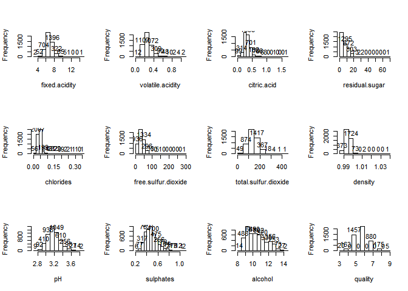 

We can see from histograms that almost all attributes other than **residual.sugar** and **alcohol** seem to have normal distribution. Both **residual.sugar** and **alcohol** are left skewed (long tail on right) and can be converted to normal distribution with some transformations. There is further confirmation of our earlier obseravtion that values are distributed evenly across the total range and **quality** has discrete integer values.

## Wine quality    

Let us look into distribution of quality deeper.

**Overall Summary**

```
##    Min. 1st Qu.  Median    Mean 3rd Qu.    Max. 
##   3.000   5.000   6.000   5.878   6.000   9.000
```

**IQR**

```
## [1] 1
```

**Frequency Table**

```
## 
##    3    4    5    6    7    8    9 
##   20  163 1457 2198  880  175    5
```

So **quality** discrete values range between 3 and 9 with no scores below 3 or above 9. As we saw in earlier boxplot we do have outliers in quality, which is confirmed by seeing that both max and min are more than 1.5*IQR away from their respective quartile. From `table` we can see we have around 4% (200/4898) outliers which is significant. 

Let us plot quality histogram to visualize this better. 

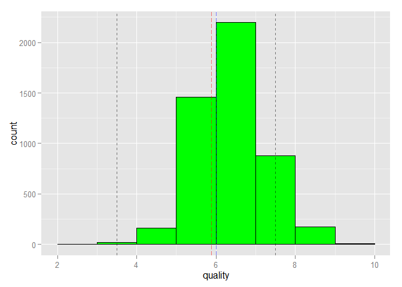 

*We can see that majority of wines have quality scores ranging from 5 to 7. Therefore there are lot more average quality wines and few poor or excellent quality wines.* 

Let us explore few more variables such as alcohol, pH and various acids as they are typically mentioned in literature related to wine quality.

## Alcohol   

Let us first look into distribution of alcohol deeper.

**Overall Summary**

```
##    Min. 1st Qu.  Median    Mean 3rd Qu.    Max. 
##    8.00    9.50   10.40   10.51   11.40   14.20
```

**IQR**

```
## [1] 1.9
```

So **alcohol** numeric values range between 8 and 14.5 with mean at 10.4.

Let us plot alcohol histogram to visualize this better. 

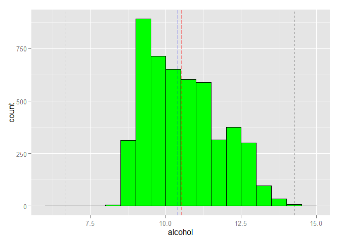 

As we saw in earlier boxplot we do **not** have outliers in alcohol, which is confirmed by seeing that both max and min are within the 1.5*IQR range from their respective quartile. We have almost normal distribution exceptional peak at 9. As median and mean are quite close, we have reasonably even distribution around mean.

## Citric.Acid   

Let us look into distribution of citric.acid deeper.

**Overall Summary**

```
##    Min. 1st Qu.  Median    Mean 3rd Qu.    Max. 
##  0.0000  0.2700  0.3200  0.3342  0.3900  1.6600
```

**IQR**

```
## [1] 0.12
```

So **citric.acid** numeric values range between 0.0 and 1.66 with mean at 0.33.

Let us plot citric.acid histogram to visualize this better. 

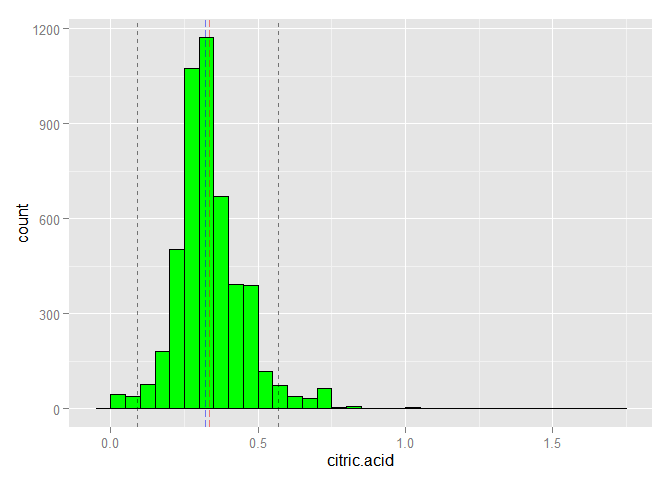 

As we saw in earlier boxplot we do have few outliers in citric.acid, which is confirmed by seeing that both min and max are more than 1.5*IQR range away from their respective quartile. We have decent normal distribution. As median and mean are quite close, we have reasonably even distribution around mean.


## Volatile.Acidity   

Let us look into distribution of volatile.acidity deeper.

**Overall Summary**

```
##    Min. 1st Qu.  Median    Mean 3rd Qu.    Max. 
##  0.0800  0.2100  0.2600  0.2782  0.3200  1.1000
```

**IQR**

```
## [1] 0.11
```

So **volatile.acidity** numeric values range between 0.08 and 1.1 with mean at 0.278.

Let us plot volatile.acidity histogram to visualize this better. 

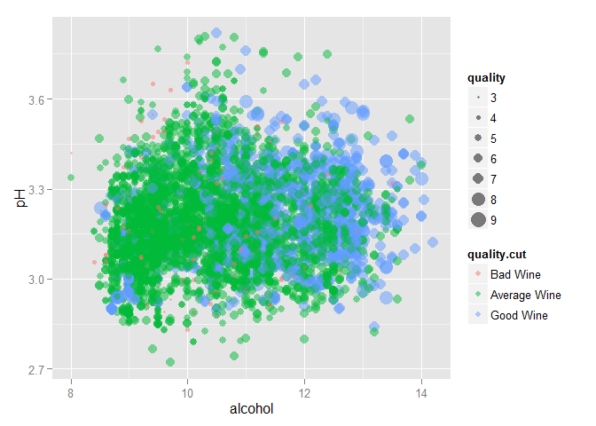 

As we saw in earlier boxplot we do have few outliers in volatile.acidity, which is confirmed by seeing that max is than 1.5*IQR range away from 3rd quartile. We have decent normal distribution with slight tail on right. As median and mean are quite close, we have reasonably even distribution around mean.

## pH   

Let us look into distribution of pH deeper.

**Overall Summary**

```
##    Min. 1st Qu.  Median    Mean 3rd Qu.    Max. 
##   2.720   3.090   3.180   3.188   3.280   3.820
```

**IQR**

```
## [1] 0.19
```

So **pH** numeric values range between 2.72 and 3.82 with mean at 3.188.

Let us plot alcohol histogram to visualize this better. 

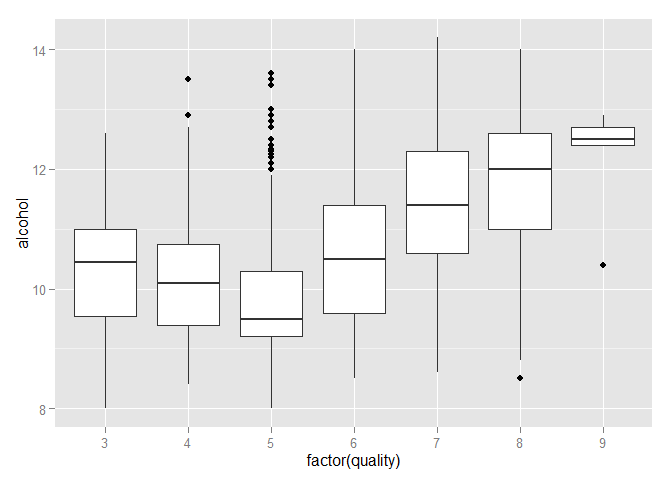 

As we saw in earlier boxplot we do have few outliers in pH, which is confirmed by seeing that both max and min are more than 1.5*IQR range away from their respective quartile. We have good normal distribution. As median and mean are quite close, we have reasonably even distribution around mean.


## Short questions

### What is the structure of your dataset?
We have a list of 4898 unnamed white wines.  They have all been rated on quality and 13 variables of each wine have been given.  Each value given is numeric other than quality and X which are integers.  The quality rating scale is from 1-10 but this dataset only has value from 3-9. A majority of the wines are in middle of the pack (average wines) with quality score of 5 and 6.

### What is/are the main feature(s) of interest in your dataset?
The main feature of interest is the output feature **quality**. We hope to find out what input features can most accurately predict the quality of a white wine.

### What other features in the dataset do you think will help support your investigation into your feature(s) of interest?
Based on how we see wines listed and cataloged, it would be good to include **alcohol** and **pH** in our model. Other features which impact the taste such as variety of **acid** related feature may also impact the quality of wine.        

### Did you create any new variables from existing variables in the dataset?
Not so far. But we do it later by creating a new variable to classify wines into **bad**, **average** and **good** quality wines.

### Of the features you investigated, were there any unusual distributions? Did you perform any operations on the data to tidy, adjust, or change the form of the data? If so, why did you do this?
We can see that other than **alcohol** most other attributes have outliers. We also see that most of the **quality** values lie between 4 to 7.  Did **not** make any major adjustments to the structure of the data.   

---

# Bivariate Plots and Analysis

Let us start zooming into potential variables that may influence quality of white wine. Starting point would be  to explore correlation between our variables.

## Finding attributes which influence quality  

Before we zoom into the set of attributes which impact the **quality** most, let us create pairwise plot for each of the attributes to see in one glance how do not only each of these attributes are distributed but get top level of idea of how they may be related to each other.  


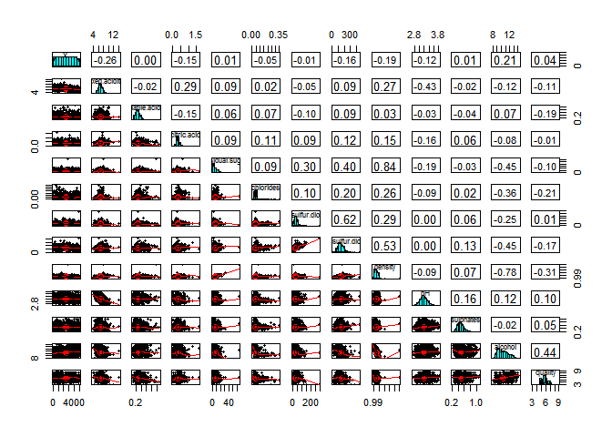 

Our pairwise plot via `pairs.panel` gives us visual birds eyeview into how each variable is distributed along with how they relate to each other. We can see that there are some strong correlation among other attributes such as **0.84** between **density** and **residual.sugar**, which can be seen in pairwise graph as well in terms of almost 45 degree line between these two attributes. Since here we are focusing on **quality** relation with other attributes, we are **not** going to explore these relationships by themselves other than in context of attributes that relate to **quality**.

Let us look deeper into these correlations.


```
##                      fxd.c vltl. ctrc. rsdl. chlrd fr.s. ttl.. dnsty pH    slpht alchl qulty
## fixed.acidity         1.00                                                                  
## volatile.acidity     -0.02  1.00                                                            
## citric.acid           0.29 -0.15  1.00                                                      
## residual.sugar        0.09  0.06  0.09  1.00                                                
## chlorides             0.02  0.07  0.11  0.09  1.00                                          
## free.sulfur.dioxide  -0.05 -0.10  0.09  0.30  0.10  1.00                                    
## total.sulfur.dioxide  0.09  0.09  0.12  0.40  0.20  0.62  1.00                              
## density               0.27  0.03  0.15  0.84  0.26  0.29  0.53  1.00                        
## pH                   -0.43 -0.03 -0.16 -0.19 -0.09  0.00  0.00 -0.09  1.00                  
## sulphates            -0.02 -0.04  0.06 -0.03  0.02  0.06  0.13  0.07  0.16  1.00            
## alcohol              -0.12  0.07 -0.08 -0.45 -0.36 -0.25 -0.45 -0.78  0.12 -0.02  1.00      
## quality              -0.11 -0.19 -0.01 -0.10 -0.21  0.01 -0.17 -0.31  0.10  0.05  0.44  1.00
```

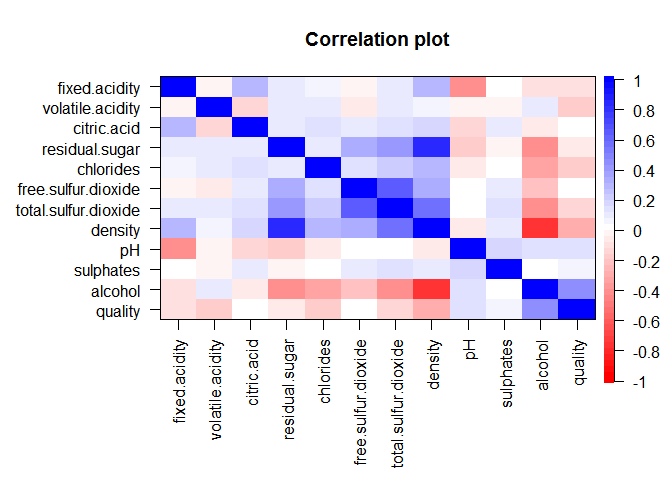 

Our correlation plot provides a nice visual view with darker shaded color indicating stronger correlation. With this visual cue and looking in pairwise correlation matrix, we can see that **quality** has strong correlation with **alcohol** (0.44), **density**(-0.31), **chlorides** (-0.21), **volatile.acidity** (-0.19), **toal.sulfur.dioxide** (-0.17) and bit weaker correlation with **fixed.acidity** (-0.11), **residual.sugar** (-0.10), **pH** (0.10).

When we look further in pairwise correlation plot and matrix, we can see that several of the strongly correlated attributes to **quality** have good correlation among themselves. Since we want to identify independent variables which impact the quality, it will be good to prune these out and select one with strongest correlation with **quality**. We see that **density** (-0.78), **total.sulphur.dioxide** (-0.45), **chlorides** (-0.36) and **residual.sugar** (-0.45) all have good correlation with our strongly correlated attributed **alcohol**. Similarly **pH** and **fixed.acidity** also have strong correlation (-0.43), which makes sense as pH is a measure of acidity on a logarithmic sale.

*Therefore it may suffice to just focus on **alcohol**, **volatile.acidity** and **pH** when modeling a relationship between quality and chemical attributes of given white wine.* We will dive deep into this hypothesis visually and numerically as we progress in this data exploration further.

Let us start exploring these correlations deeper.

### Alcohol  

Alcohol has strongest correlation with wine which seems to make sense as typically wine's perception does relate to alcohol content.

To understand how alcohol may be related to quality, we can ask few questions about how are alcohol values distributed across quality levels:

1. What is the average alcohol content for each quality?
2. Is there a threshold difference in alcohol content across quality levels?

Let us answer first question of average alcohol content for each quality level.

**Average alcohol for each quality level**

```
##        3        4        5        6        7        8        9 
## 10.34500 10.15245  9.80884 10.57537 11.36794 11.63600 12.18000
```

**Visual boxplot of alcohol for each quality level**
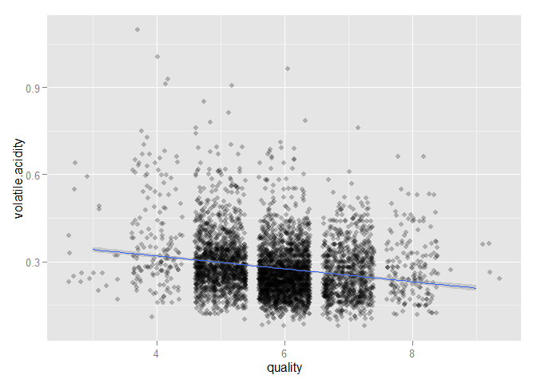 

We can see that **alcohol** content does seems to increase as **quality** level increases for higher quality wines with score of 6 and above.

Let us visualize this deeper with a scatter plot.

**Scatter plot of alcohol versus quality**
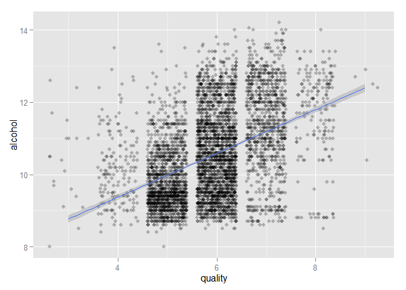 

We can see a good linear regression line with balanced increasing slope indicating **strong linear correlation** between **alcohol** and **quality**. Higher quality wine tend to have higher mean alcohol content threshold above 11.

### Voaltile.Acidity  

Volatile.acidity has good correlation with wine which seems to make sense as typically wine's  taste does relate to acid amount. 

To understand how volatile.acidity may be related to quality, we can ask few questions about how are volatile.acidity values are distributed across quality levels:

1. What is the average volatile.acidity content for each quality?
2. Is there a threshold difference in volatile.acidity content across quality levels?

Let us answer first question of average volatile.acidity content for each quality level.

**Average volatile.acidity for each quality level**

```
##         3         4         5         6         7         8         9 
## 0.3332500 0.3812270 0.3020110 0.2605641 0.2627670 0.2774000 0.2980000
```

**Visual boxplot of volatile.acidity for each quality level**
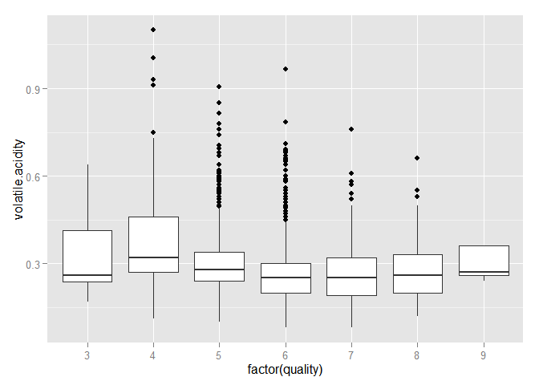 

We can see that **voaltile.acidity** content seems to decrease as **quality** level increases except for very low or very high quality wines. Therefore volatile.acidity has negative influence on quality of wine.

Let us visualize this deeper with a scatter plot.

**Scatter plot of volatile.acidity versus quality**
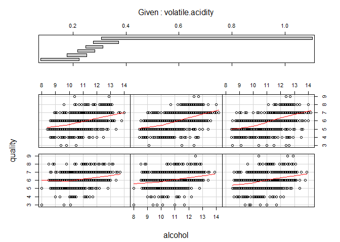 

We can see a decent linear regression line with decent decreasing slope indicating **good linear correlation** between **volatile.acidity** and **quality**. Therefore volatile.acidity has negative influence on quality of wines. Higher quality wine tend to have lower mean volatile.acidity content threshold below 0.3. 

This finding that low amount of volatile acidity is good for wine is not surprising as it ha connection with aroma of wine. Volatile acidity is an unstable acid formed by dissolving carbon dioxide in water. Generally seen as a fault in wine since it is quite disagreeable when excessive, although a tiny amount can enhance aromas in wine. Therefore good wine is likely to contain a small amount of acetic acid where as low quality wine may contain larger amount.

### pH  

Now let us look at our last attribute **pH**. We can recall from earlier observations that
**pH** is not so strongly correlated as previous two attributes. 

To understand how pH may be related to quality, we can ask few questions about how are pH values are distributed across quality levels:

1. What is the average pH content for each quality?
2. Is there a threshold difference in pH content across quality levels?

Let us answer first question of average pH content for each quality level.

**Average pH for each quality level**

```
##        3        4        5        6        7        8        9 
## 3.187500 3.182883 3.168833 3.188599 3.213898 3.218686 3.308000
```

**Visual boxplot of pH for each quality level**
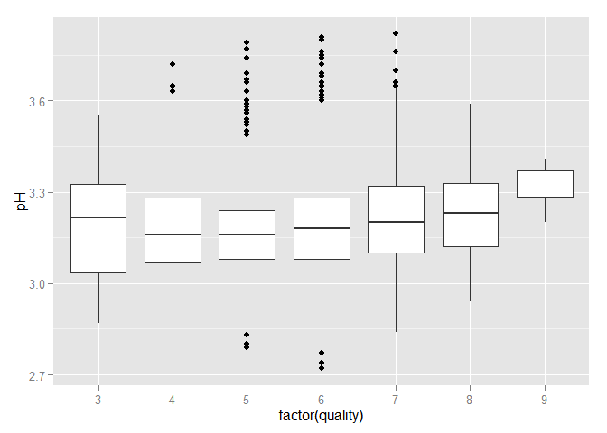 


We can see that **pH** content seems to increase as **quality** level increases except for very low quality wines.

Let us visualize this deeper with a scatter plot.

**Scatter plot of pH versus quality**
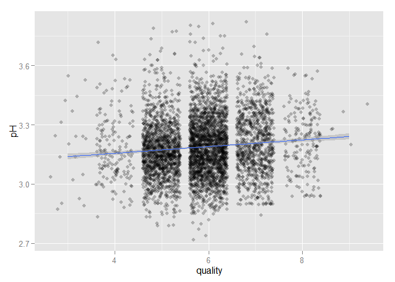 

We can see a average linear regression line with small increasing slope indicating **average linear correlation** between **pH** and **quality**. Higher quality wine tend to have higher mean pH content threshold above 3.2.

**So overall we see that higher quality wines tend to have higher alcohol and pH but lower level of volatile acid.**

### Both Alcohol and Volatile.Acidity together

Since we have stronger correlation of **quality** with **alcohol** and **volatile.acidity**, let us see visually how they impact together.

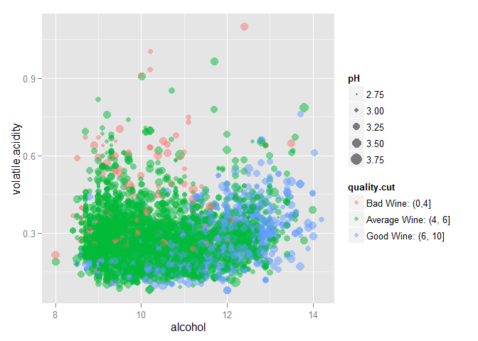 

We can see that **alcohol** impacts **quality** in positive way stronger and stronger as **voaltile.acidity** levels increase.


## Short Questions

### Talk about some of the relationships you observed in this part of the investigation. How did the feature(s) of interest vary with other features in the dataset?
We can see that **quality** has strong correlation with **alcohol** (0.44), **density**(-0.31), **chlorides** (-0.21), **volatile.acidity** (-0.19), **toal.sulfur.dioxide** (-0.17) and bit weaker correlation with **fixed.acidity** (-0.11), **residual.sugar** (-0.10), **pH** (0.10).


### Did you observe any interesting relationships between the other features (not the main feature(s) of interest)?
We can see that there are some very strong correlation among other features such as **density** and **residual.sugar**. We also see that **density** , **total.sulphur.dioxide**, **chlorides** and **residual.sugar** all have good correlation with **alcohol**. Similarly **pH** and **fixed.acidity** also have strong correlation between them, which make sense as pH is measure of acidity on a logarithmic sale.

### What was the strongest relationship you found?
Strongest correlation is between **density** and **residual.sugar** (0.84).

---

# Multivariate Plots and Analysis

Let us continue to dive deeper into relationships we have discovered so far, mainly how **alcohol**, **volatile.acidity** and **pH** influence our quality levels. To explore these relations from another angle, let us group quality levels into three major categories: low level, average level and high level wines.

## Classifying wines as bad, average and good 

Let us classify our wines as following:

1. **Bad**: Quality score up to 4
2. **Average**: Quality score between 5 and 6
3. **Good**: Quality score 7 and above

**Add another variable quality.cut to repersent wine classification**

```
## 
##      Bad Wine: (0,4] Average Wine: (4, 6]   Good Wine: (6, 10] 
##                  183                 3655                 1060
```

As we can see majority of wines are in **average** category.

Let us visualize the relationship between our chosen attributes and quality as sliced by wine quality classification.

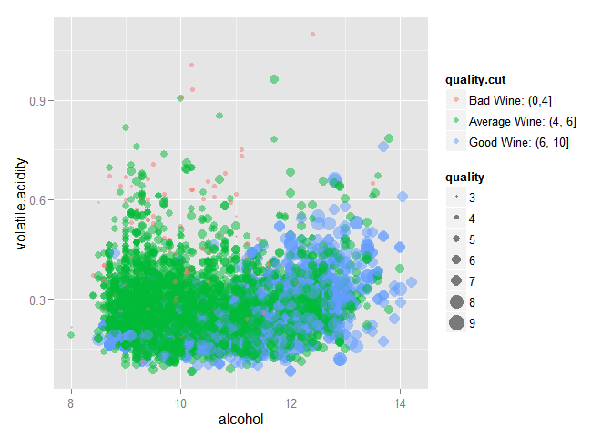 

We can see that majority of good wines are in lower right quadrant of the graph, where alcohol content is higher and volatile.acidity is lower. We can further observe that a large cluster of good wine in lower right has alcohol content greater than 11 and volatile.acidity less than 0.45.

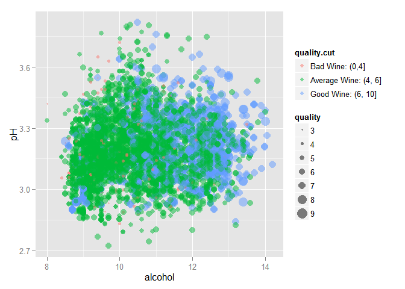 

We can see that majority of good wines are in right half of the graph, where alcohol content is higher and volatile.acidity is in middle range. We can further observe that a large cluster of good wine in right half has alcohol content greater than 11 and pH between 2.9 to 3.4.

Now let us try to bring all these together in a single visualization.

 

We can see that majority of good wines are in lower right quadrant of the graph, where alcohol content is higher, volatile.acidity is lower and pH is in middle range (middle size symbols). We can further observe that a large cluster of good wine in lower right has alcohol content greater than 10.75, volatile.acidity less than 0.5 and pH between 3 to 3.5.

## Model

Now that we have set of attributes which seem to have good correlation with quality. We can try to create a model using linear regression.

**quality = C0 + C1 * alcohol + C2 * volatile.acidity + C3 * pH**


```
## 
## Calls:
## m1: lm(formula = quality ~ alcohol, data = wine)
## m2: lm(formula = quality ~ alcohol + volatile.acidity, data = wine)
## m3: lm(formula = quality ~ alcohol + volatile.acidity + pH, data = wine)
## 
## ===============================================
##                      m1        m2        m3    
## -----------------------------------------------
## (Intercept)        2.582***  3.017***  2.337***
##                   (0.098)   (0.098)   (0.245)  
## alcohol            0.313***  0.324***  0.321***
##                   (0.009)   (0.009)   (0.009)  
## volatile.acidity            -1.979*** -1.966***
##                             (0.110)   (0.110)  
## pH                                     0.224** 
##                                       (0.074)  
## -----------------------------------------------
## R-squared             0.190     0.240     0.242
## adj. R-squared        0.190     0.240     0.241
## sigma                 0.797     0.772     0.771
## F                  1146.395   773.875   519.857
## p                     0.000     0.000     0.000
## Log-likelihood    -5839.391 -5681.776 -5677.165
## Deviance           3112.257  2918.264  2912.775
## AIC               11684.782 11371.552 11364.330
## BIC               11704.272 11397.538 11396.813
## N                  4898      4898      4898    
## ===============================================
```

We can see that we are getting **R^2** value of **0.24** with our 3rd model (**m3**) which models the above linear quality equation with three attributes (alcohol, volatile.acidity and pH). We can also see that attribute **pH* is not having significant impact as difference in R^2 value between 2nd model (m2) and 3rd model (m3) is quite small.

Let us examine 3rd model deeper.


```
## 
## Call:
## lm(formula = quality ~ alcohol + volatile.acidity + pH, data = wine)
## 
## Residuals:
##     Min      1Q  Median      3Q     Max 
## -3.4101 -0.4871 -0.0407  0.4982  3.1400 
## 
## Coefficients:
##                   Estimate Std. Error t value Pr(>|t|)    
## (Intercept)       2.336563   0.244574   9.554   <2e-16 ***
## alcohol           0.321041   0.009049  35.479   <2e-16 ***
## volatile.acidity -1.965689   0.109717 -17.916   <2e-16 ***
## pH                0.223561   0.073614   3.037   0.0024 ** 
## ---
## Signif. codes:  0 '***' 0.001 '**' 0.01 '*' 0.05 '.' 0.1 ' ' 1
## 
## Residual standard error: 0.7715 on 4894 degrees of freedom
## Multiple R-squared:  0.2417,	Adjusted R-squared:  0.2412 
## F-statistic: 519.9 on 3 and 4894 DF,  p-value: < 2.2e-16
```

```
##      (Intercept)          alcohol volatile.acidity               pH 
##        2.3365632        0.3210409       -1.9656891        0.2235611
```

We can see that our linear equation is:

**quality ~ 2.336 + 0.321 * alcohol - 1.965 * voaltile.acidity + 0.223 * pH**
 
We also see that we have good degree of confidence in most of above coefficients. Large range of residual (min of -3.4 to max of 3.14) as compared to IQR of around 1 with median close to 0.04 seems to suggest some outliers may be spoiling our model. 

Let us look at our model visually.

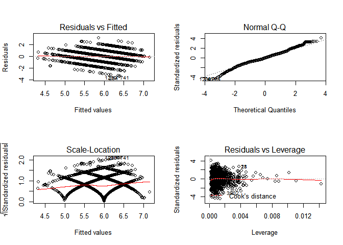 

We can see that first plot (residual v/s fitted) does indicate close to zero line on average with residuals spread out on both sides of this trend line. Similarly we see in second Q-Q graph that good normal distribution of residuals as most of them do line except bit on lower and higher side (outliers?). We also see small cook's distance other than few outliers. Therefore we can say we our linear model is a decent fit.

Let us visually see how each of attributes impacts the output (quality) in our model.

** Influence on predicted output quality (repersented as partial on y-axis)** 
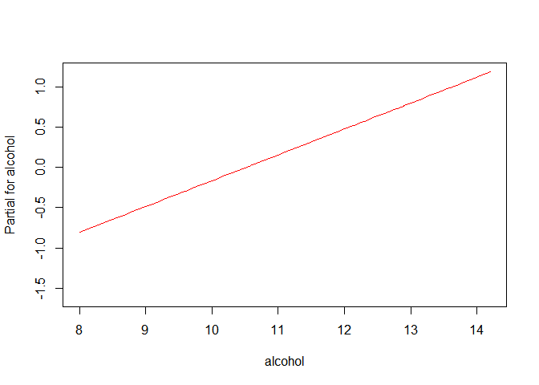 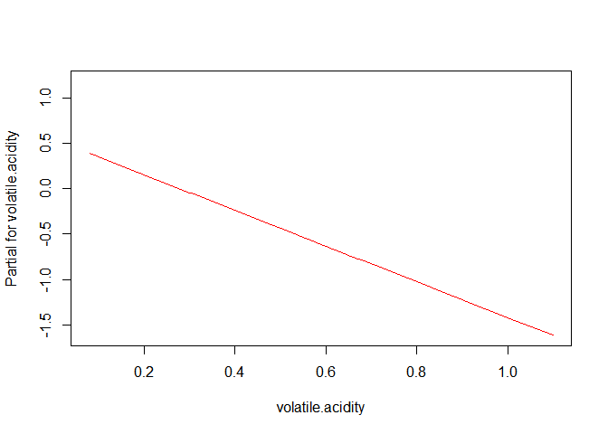 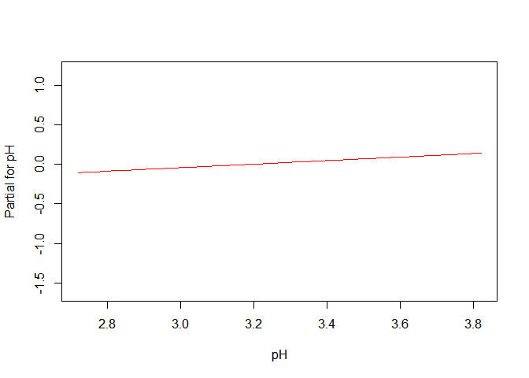 

We can see that while **alcohol** positively impacts **quality** but **volatile.acidity** negatively impacts **quality**. The **pH** has very small positive impact on **quality**. These results are not surprising and are very much in line with our correlation analysis earlier.

## Short Questions

### Talk about some of the relationships you observed in this part of the investigation. Were there features that strengthened each other in terms of looking at your feature(s) of interest?
**Alcohol** and **volatile.acidity** strengthened each other to impact the quality of wine.   

### Were there any interesting or surprising interactions between features?
Although not completely surprising **pH* did not influence *quality* as much. Also saw that there was a pattern combination of alcohol and volatile acidity when it came to determining quality of wines. Generally higher alcohol and moderate volatile.acidity led to higher quality of white wine.


### OPTIONAL: Did you create any models with your dataset? Discuss the strengths and limitations of your model.
Yes, created a linear regression model that uses the **alcohol**, **volatile.acidity** and **pH** of white wine to predict its quality. Here is the linear equation the model came up with:

**quality ~ 2.336 + 0.321 * alcohol - 1.965 * voaltile.acidity + 0.223 * pH**

This model is not the strongest and can be improved further. Would like to see **R^2** of **0.24** go up further possibly with a polynomial regression (e.g. cubic equation), combination of other features not considered. Several outliers are playing spoilsport in prediction with this model. A larger data-set along with some other attributes which relate better with taste and body of white wine may help further to build a better predictive model.

---

# Final Plots and Summary

We have chosen to select three plots that lead us gradually to our final conclusion on how we can predict the quality of white wine based on given chemical properties. 

## Plot One

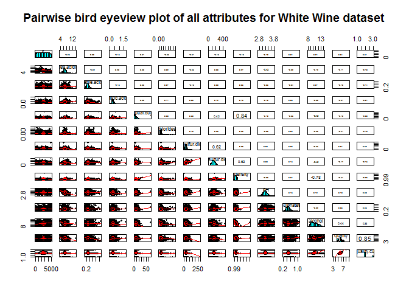 

**DESCRIPTION: Our paiwise plot via `pairs.panel` gives us birdeye visual view into how each variable is ditributed along with how they relate to each other. Clearly attribute *X* is just a serial id for each observation. All other attributes except *quality* have a continuous value. We can see that almost all attributes other than *residual.sugar* and *alcohol* seem to have normal distribution. Both *residual.sugar* and *alcohol* are left skewed and can be converted to normal distribution with some transformations.** 

## Plot Two

 

**DESCRIPTION:  This correlation matrix plot provides are nice visual view with darker shaded color indicated stronger correlation.  We can see that *quality* has strong correlation with *alcohol* (0.44), *density*(-0.31), *chlorides* (-0.21), *volatile.acidity* (-0.19), *toal.sulfur.dioxide* (-0.17) and bit weaker correlation with *fixed.acidity* (-0.11), *residual.sugar* (-0.10), *pH* (0.10).**

We also see that **density** (-0.78), **total.sulphur.dioxide** (-0.45), **chlorides** (-0.36) and **residual.sugar** (-0.45) all have good correlation with our strongly correlated attributed **alcohol**. Similarly **pH** has strong correlation (-0.43) with **fixed.acidity**. Therefore it may suffice to just focus on **alcohol**, **volatile.acidity** and **pH** as set of attributes which have most independent influence on quality of white wine.


## Plot Three
 
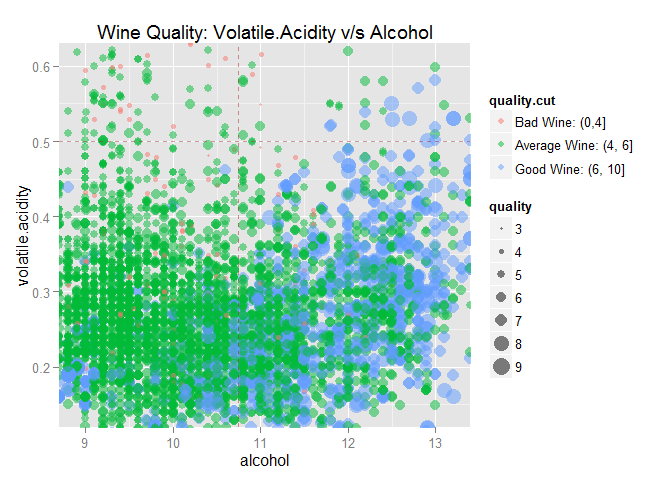 

**DESCRIPTION: This is a multivariate plot between *volatile.acidity* and *alcohol* whose points are colored and size appropriately with *quality*. This plot provide a good summary visual view of how alcohol and volatile.acidity related to different quality of white wine.**

We can summarize following from above plot:

1. **Good Wines (having score above 6)**: *These mostly lie in lower right quadrant (volatile.acidity less than 0.5 and alcohol content larger than 10.75). Therefore good white wine tends to have higher amount of alcohol and moderate to low amount of volatile acid.*

2. **Average Wines (having score from 5 to 6)**: *These mostly lie in lower left quadrant (volatile.acidity less than 0.5 and alcohol content less than 10.75). Therefore average white wine tends to have lower amount of alcohol and moderate to low amount of volatile acid.*

3. **Bad Wines (having score less than 5)**: **These mostly lie in upper left quadrant (volatile.acidity more than 0.5 and alcohol content less than 10.75). Therefore poor quality white wine tends to have lesser amount of alcohol and high amount of volatile acid.*

**So in summary trying to answer our question "*Which chemical properties influence the quality of white wines?*", we have found out that *alcohol* and *volatile.acidity* influence our *quality* of wine significantly. We also observed that a large cluster of good wines have alcohol content greater than 10.75 and volatile.acidity less than 0.5.**

---

# Reflections  

Determination of wine quality is quite a complex inter-play of culture, society, reputation of a region or vineyard along with its chemical components which give wine its distinctive taste and aroma. The whole chemical composition of a wine embodies the various stages of the wine producing process, including the grape variety, yeast strain, the containers used for fermentation and storage, and the ecological practice. Human sense of taste  and aroma is not so well understood. This means wine classification is typically left to wine experts.

While rating of a wine (quality) by experts is ultimately a subjective matter, but one could analyze the different chemical components and their inter-play in wine to come up with best guess on wine rating.  We were able to identify few patterns which can help int his regard. While we have been able to find a way to relate quality of white wines with alcohol and volatile acid content, there are certain outliers which indicate that there must be other factors in the play which determine white wine quality. These factors such as smell, taste, soil and climate conditions where grapes were grown, etc, which are not captured in this data-set, may influence the white wine quality.

It will be interesting to see if our observations and model holds good for other kind of white wines outside the region of this data-set came from. There may also be other ways to build a predictive model other than our linear regression model such as polynomial regression, machine learning or SVM, etc.

This kind of model can also be used to do quick fraud detection, crude wine classification and possibly enhance the training of students trying to become wine experts!

# References

Besides the Udacity course material in "Data Analysis with R", here is a list of some of the materials explored while working on this project.

1. http://www.vinhoverde.pt/en/promotional-materials
2. http://www.cookbook-r.com/Graphs/index.html
3. http://www.physics.csbsju.edu/stats/box2.html
4. http://www.inside-r.org/packages/cran/psych/docs/00.psych
5. http://zief0002.github.io/Computing-Club/notes/2015_S/2015_S_02_Visual_Diagnostics.html


